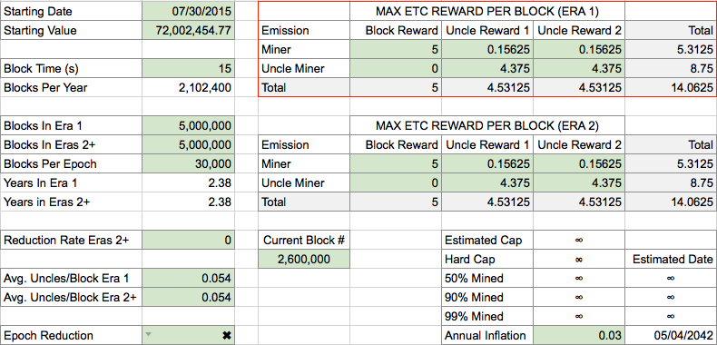

### Title

    ECIP: 1017
    主题:ETC 货币政策和铸币方案最终修改
    作者:Matthew Mazur 5n4pr011@gmail.com
    翻译:Roy (以太坊原链协会 ECC) QQ:1251433202
    状态:起草阶段
    类型:标准
    创建:2016/11/20

 

### 摘要

这个 ECIP 提议了一个 ETC 货币政策的解决方案,为最后的调整做准备,目前的出币方案是每 个区块永远固定在 14.0625ETC。此解决方案带来了理论上的总量上限和一个随着时间递减的出币 规律。

 

### 原动力

从核心上来说,将现在 ETC 网络的货币政策调整为一个有上限数量的代币和随着时间递减的出 币规律的目的,最重要的出发点是维护网络的安全,让其有自力更生的能力。通过提高网络的安全 性能,一个合适的货币政策将间接地促进网络的发展,提供一个为所有智能合约开发所需的安全平 台。

如果我们承认投机需求是一个新经济系统的主要经济动力,显然 ETC(Ethereum Classic)网络是 一个全新的系统,那么投机需求会驱动 ETC 的价格往前走,直到 ETC 网络真正的实用价值超过它 的投机价值。回应投机需求来帮助培育和提供网络的安全性就是有原因的:

大型、高风险、或者高价值的应用如果脱离了一个安全的网络就很难发展了,譬如我们的算力 很低的话。提高 ETC 币的需求会直接刺激 ETC 币价的上涨。ETC 币价的上涨会激励矿工的积极 性,吸引更多的矿工来挖矿,更多的矿工意味着更高的安全性。一个高安全性的网络有助于在网 络、现有用户和潜在用户、以及开发者之间建立良好的信任关系。这个信任鼓励大型的、高风险的 或者高价值的应用等需求来到这个网络。因此,奖励投机需求有助于培育和提高 ETC 网路的安全 性。

这对加密货币早期 Era 来说特别重要,假设所有的条件都是相同的,一个产量递减和有上限的 币比一个没有产出规律和没有上限的币显而易见地会提供更多的激励给高风险投机者。

综上所述,承认一个货币政策并没有直接为网络创造价值这个观点是很重要的。拥有一些好的 应用和一个活跃的社区等诸多条件的稳定平台才能驱动价值。设计适当的货币政策方案是创造一个 激励机制、促使人们愿意在这个还没有完全发挥自身潜力网络进行高风险投资的目的。为那些还没 有对这个网络产生兴趣或还没有在这个网络进行任何开发或者到目前为止还保持怀疑的这些人来说 一个很好的激励,鼓励让他们加入到一个还处于早期发展 Era 的平台上来。
 

### 详细说明

####目前的 ETC 货币政策

[来源](http://ethdocs.org/en/latest/mining.html)

ETC 网络目前的挖矿奖励模型如下:

* 一个“静态”区块奖励是胜出的区块将会得到 5 ETC 的奖励。

* 一个额外的奖励是胜出的矿工得到包括每叔块 1/32 (0.15625ETC) 的奖励,最高是两 个叔块。

* 在竞争中胜出的矿工得到的区块奖励为 7/8 (4.375ETC),里面包括叔块奖励,最高是 两个叔块。

* 这个奖励设计会被一直执行。

 

####建议中的 ETC 货币政策

[来源](https://docs.google.com/spreadsheets/d/1Fs_RNEPSRJxP22PZmwxWjiulVVcu5Ic1GvBXCPCt9to/edit?usp=sharing)

*Era" 被定义为特定区块数量里包含了一个特定的出币率。*

建议中的 ETC 挖矿奖励模型如下:

* Era 1 (区块 1 - 5,000,000)

    * 一个“静态”区块奖励是胜出的区块将会得到5ETC的奖励。
    * 一个额外的奖励是胜出的矿工得到包括每叔块 1/32 (0.15625ETC) 的奖励,最高是两 个叔块。
    * 在竞争中胜出的矿工得到的区块奖励为7/8(4.375ETC),里面包括叔块奖励,最高是 两个叔块。

* Era 2 (区块 5,000,001 - 10,000,000)

    * 一个“静态”区块奖励是胜出的区块将会得到4ETC的奖励。
    * 一个额外的奖励是胜出的矿工得到包括每叔块 1/32 (0.125ETC)的奖励,最高是两个 叔块
    * 在竞争中胜出的矿工得到的区块奖励为 1/32 (0.125ETC),里面包括叔块奖励,最高 是两个叔块。
    * Era 2 是在 Era 1 阶段区块奖励基础上进行 20%减产,叔块奖励也同时减产。

* Era 3+

    * 进入新一个Era阶段后产出会在前一个Era阶段产出的基础上进行一个持续20%的减 产。
    * 每个Era阶段为5,000,000区块进入下一个Era。

 

### 基本原理

为什么是 5M20 模型:

* 在第 5 百万区块高度时所有的叔块奖励设置成相等,实行减产规律不会随时间而改变,使得 第一个调整不那么激进。

* 这个模型很容易被理解:每 5 百万区块实行总奖励按 20%递减。

* 叔块出块率在 5 百万区块高度以后将会保持大概 5%左右。基于此,网络一旦达到 5 百万区 块高度,在最坏的情况下,总供应量将不会超过 2.107 亿 ETC。如果网络保持在 Era 1 的产 出能力 (5.4%叔块率),总供应量则不会少于 1.985 亿 ETC。这个机制为矿工提供了激励,客 户端开发者也愿意以高标准来维护他们在 ETC 网络上开发的硬件和软件。

* 5M 模型在一个可接受的减产率和维持一个随着时间递增的有效供应量之间取得了平衡。这 给这个系统的高风险投资带来了预期的奖励,并且假如在初期产出递减为零时需要保证代币 的潜在价格能够确保交易价格保持一个较低的水平。假如动态燃料模型在可见的未来不能实 现,这个方案提供了一个高价格的“减压阀”。

* 在第 5M 区块高度实行货币政策还平衡了以下两个方面:延迟实施为代码开发提供了足够的 开发和测试时间,而相对较快部署方案给潜在的接纳者和高风险投资者提供了激励。从早期 的社区讨论共识里,在 4 百万区块高度之前实行会太快,没有足够的时间来开发,测试和部 署这个货币政策,而迟于 6 百万区块高度对于许多潜在的接受者/投资者来说太迟。

* 不改变现有的 ETC 货币政策对风险喜好的投资者来说是没有吸引力的,这对于网络安全的自 我完善也是困难的。虽然比特币拥有被广泛接受的货币政策,币产出每 4 年进行减半,但这 对 ETC 并不是最优化的投资模型。如果 ETC 采用了比特币的减半模型,那币供应速度会变 得太快:大约 50%的总量供应会很快被产生出来。产生 75%的币总量会比传统的比特币时间 更快,因为 ETC 用大约 7200 万的比在创世块首先被创建出来,但是 5M 模型并没有去掉这 个预挖的影响。由于大约 50%总量的币跟比特币相比会更快被产生出来,这个时候作为补 偿,那么当产出 90%,99%和 100%的时候,它的尾巴会变得更长和更宽。

* 在 ETC 现有的奖励模式里,叔块总共的奖励是要高于矿工挖到包含叔块所得的奖励。在这种 情况下,一个矿工所得会很显著地冲淡包括叔块的奖励价值。通过将叔块矿工的奖励与包含 叔块区块的奖励设成相等的,会使得奖励模型更公平。另外,将叔块奖励均等化可以减少对 矿工专门设置一个“叔块矿场”来挖叔块的动机,转而将他们引导向为了“真区块”而竞争从而加 强了整个网络的安全。

* 因为包含叔块区块的奖励率差异性很大,减少叔块区块的奖励有助于准确预测 ETC 最终的总 供应量。

* 这个模型在提供高风险投资者的激励从而给系统带来安全性的提高和培养潜在的客户用户群 之间取得最好的平衡。此模型也易于理解,包括一个随着时间而递减的产量,一个总量上 限,并且给系统带来一个长期稳定的 ETC 代币供应量。

 

### 实施

*译者注*
